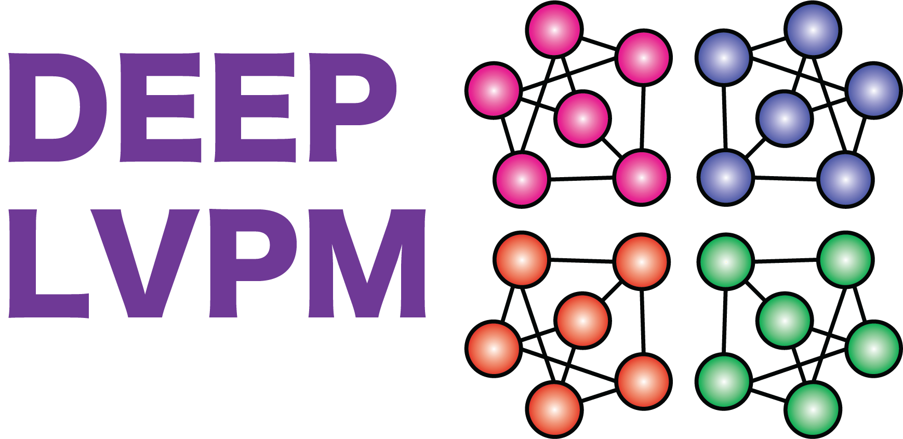

**Installation**

We recommend installing Deep LVPM using pip:

~~~

pip Deep_LVPM

~~~

**Deep LVPM**

Deep Latent Variable Path Modelling (DLVPM) is a method for path/structural equation modelling utilising deep neural networks. The aim of the method is to connect different data types together via sets of orthogonal latent variables. 

The implementation of this method is built around a custom keras/tensorflow model called StructuralModel, which utilises several custom keras/tensorflow layers for constructing Deep Latent Variables (DLVs) from input data.

The user must specify a path model defining which data types should be linked by the DLVPM model, along with a neural network model for each data-view, which is then used to optimise associations/linkages between DLVs derived from each data-type.

For example, starting with three randomly generated arrays:

~~~

# import all necessary packages required for this tutorial
import tensorflow as tf
import numpy as np
import Deep_LVPM as dlvpm

# Generate random arrays using numpy
Data_A = np.random.rand(1000,100)
Data_B = np.random.rand(1000,500)
Data_C = np.random.rand(1000,50)
~~~

We then define tensorflow models to use:

~~~

# We define new models using keras/tensorflow, modelA_input and modelB_input are defined using the sequential API. modelC is defined using the functional API

modelA_input = tf.keras.sequential()
modelA_input.add(tf.keras.layers.Dense(50, input_shape=(Data_A.shape[1],)))
modelA_input.add(tf.keras.layers.Dense(50))

modelB_input = tf.keras.sequential()
modelB_input.add(tf.keras.layers.Dense(100, input_shape=(Data_B.shape[1],)))
modelB_input.add(tf.keras.layers.Dense(100))

modelC_input = tf.keras.sequential()
~~~

Models can be defined using any of the keras APIs i.e. functional, sequential, or using model subclassing.

These models are then used as inputs to the DLVPM model. Both models and data are entered into the DLVPM model as lists:

~~~

# Define a model list, which will then be used as an input to the DLVPM model
model_list = [modelA, modelB, modelC]

# Define a list containing the data types to be connected:
Data_list = [Data_A, Data_B, Data_C]

~~~

We must also define a path model, in the form of an adjacency matrix, which defines the data views that are connected to one another. 

~~~

# Here, we define a new adjacency matrix, which defines which data views to connect
C = tf.constant([0,1,1],
            [1,0,1],
            [1,1,0])
~~~

The model list and adjacency matrix are used as inputs to the structural model. The structural model also takes a number of other inputs (see section on StructuralModel for more information):

The StructuralModel creates DLV projection weights internally. It will often be useful to add some weight regularization to these projection layers. This can be done using a list of keras/tensorflow regularizers, where each element of the list corresponds to a different measurement model:

~~~

regularizer_list = []

ndims = 5 # the number of DLVs we wish to extract
tot_num = Data_A.shape[0] # the total number of samples, which is used for internal normalisation

DLVPM_Model = dlvpm.StructuralModel(C_mv, model_list, regularizer_list, tot_num, ndims, epochs, batch_size)

~~~

It is then necessary to compile the model before training. Here, we must define an optimizer for each data view to be connected. These are entered into the model as a list:

~~~

optimizer_list = [tf.keras.optimizers.Adam(learning_rate=1e-5),tf.keras.optimizers.Adam(learning_rate=1e-5),tf.keras.optimizers.Adam(learning_rate=1e-5)]

DLVPM_Model.compile(optimizer=optimizer_list)

~~~

We then run model training using the fit function:

~~~

DLVPM_Model.fit(Data_list, batch_size=batch_size, epochs=epochs,verbose=True)

~~~

We can then evaluate the model:

~~~

metrics = DLVPM_Model.evaluate(Data_list)

~~~

The first metric in the list that is produced here is the mean squared error. The second metric is the mean pearson's correlation coefficient between models/data connected by the path model.

We can use the predict function to obtain the deep latent variables for different data views. 

~~~

DLVs = DLVPM_Model.predict(Data_list)

~~~

This function gives the Deep Latent Variables (DLVs) in the form of a 3-D tensor of size tot_num x len(model_list) x ndims. We can then examine the association between individual latent variables. For example:

~~~

Cmat1 = np.corrcoef(DLV[:,0,:])

~~~

Gives a 2-D matrix of associations between the first of the DLVs, for each data view. Associations are high as the DLVPM algorithm is designed to optimise associations between DLVs constructed from different data types. 

In contrast, if we calculate associations between different DLVs from the same data-types:

~~~

Cmat2 = np.corrcoef(DLV[:,:,0])

~~~

We get associations close to zero i.e. these DLVs are orthogonal.

Once the model has been trained, we can save it for future use using:

~~~

DLVPM_Model.save('output_folder/DLVPM_Model.keras')

~~~

Note that, as the model utilises custom keras/tensorflow models and layers, it is necessary to save the model in the new .keras format. Problems may arise from saving the model in older formats utilised by keras/tensorflow.

In the text below, we give an explanation of each of the custom model and layer types that are used in the DLVPM toolbox.

# StructuralModel

`StructuralModel` is a custom TensorFlow/Keras class designed for uncovering deep latent variables that represent correlated factors between different data types. The `StructuralModel` utilizes a binary adjacency matrix to define connections between different data views. It incorporates multiple Keras models, each corresponding to a specific data view, and integrates them to optimize associations using DLVs.

This model also depends on the custom layers `FactorLayer` and `ZCALayer`, these layers are called internally using this method. The layer that is used is determined by whether the user selects 'Moore-Penrose' or 'zca' for the orthogonalisztion parameter.

# Attributes

- **C_mv**: Binary adjacency matrix defining connections between data views.
- **model_list**: List of Keras models, one for each data view.
- **regularizer_list**: List of regularizers applied to projection layers in each data-view model.
- **tot_num**: Total number of features across all data batches.
- **ndims**: Number of orthogonal latent variables to be constructed.
- **epochs**: Number of training epochs.
- **batch_size**: Batch size used during training.
- **orthogonalization**: Specifies the orthogonalization method ('Moore-Penrose' or 'ZCA').

# Tracking Metrics

- **loss_tracker_total**: Tracks total loss during training.
- **corr_tracker**: Tracks correlation metrics during training.
- **loss_tracker_mse**: Tracks mean squared error loss during training.

# Methods

- **__init__(...)**: Initializes the `StructuralModel` instance.
- **add_DLVPM_layer(...)**: Adds a `FactorLayer` or `ZCALayer` to a given model.
- **call(inputs)**: Runs data through each sub-model for the data views.
- **train_step(inputs)**: Performs a training step, updating model weights.
- **compile(optimizer)**: Configures the model for training with specified optimizers.
- **test_step(inputs)**: Evaluates the model on test data.
- **mse_loss(...)**: Calculates mean squared error loss.
- **corr_metric(...)**: Calculates the correlation metric.
- **get_config()**: Returns the configuration of the model.
- **from_config(config)**: Creates an instance of the model from a configuration.
- **get_compile_config()**: Retrieves the optimizer configurations.
- **compile_from_config(config)**: Compiles the model using a specified configuration.

# Input

- **inputs**: A list of input tensors, each representing a different data view.

# Example Usage

The `StructuralModel` is particularly useful in scenarios involving multi-view data analysis, where establishing connections and correlations between different data types is crucial. This model effectively integrates multiple sub-models, each tailored to a specific data view, and employs advanced techniques like orthogonalization to uncover the underlying relationships between these views.

~~~

import tensorflow as tf
from custom_models import StructuralModel

# Example usage of StructuralModel
model = StructuralModel(
    C_mv=adjacency_matrix,
    model_list=[model1, model2, ...],
    regularizer_list=[regularizer1, regularizer2, ...],
    tot_num=total_features,
    ndims=number_of_latent_variables,
    epochs=training_epochs,
    batch_size=batch_size,
    orthogonalization='Moore-Penrose'
)

model.compile(optimizer=tf.keras.optimizers.Adam())

~~~~

# FactorLayer

This document provides detailed information about the `FactorLayer`, a custom TensorFlow/Keras layer that is part of the DLVPM (Deep Latent Variable Projection Models) toolbox. The `FactorLayer` is designed to generate orthogonal factors that are highly correlated between different data views. This layer is called internally by StructuralModel. It is the option that is called by DLVPM when orthgonalisation = 'Moore-Penrose' is selected when the 'StructuralModel' is instantiated. This is also the default option of DLVPM.

# Overview

The `FactorLayer` performs three primary operations:

1. **Batch Normalization**: Normalizes inputs based on batch statistics.
2. **Orthogonalization**: Orthogonsalises Deep Latent Variable (DLV) outputs from the layer
3. **Linear Projection**: Projects the neural network outputs into a space where they correlate with outputs from other data views.

The layer behaves differently during training and testing, similar to other adaptive layers like batch normalization.

# Attributes

- **kernel_regularizer**: Regularizer function applied to the projection layer's kernel weights. Can be `None` or a TensorFlow/Keras regularizer object.
- **epsilon**: A small constant (default: 1e-6) added to variance in batch normalization to avoid division by zero.
- **momentum**: Momentum (default: 0.95) for moving average and moving variance in batch normalization.
- **tot_num**: Total number of samples used in training. Optimizes scaling of covariance matrices.
- **ndims**: Number of Deep Latent Variable (DLV) dimensions to extract.
- **run**: TensorFlow variable tracking the number of runs to initialize moving variables on the first call.

# Constructor Arguments

- **kernel_regularizer**: Optional. Regularizer for the projection layer's kernel weights.
- **epsilon**: Optional. Offset for batch normalization.
- **momentum**: Optional. Momentum for moving averages in batch normalization.
- **tot_num**: Optional. Total number of training samples.
- **ndims**: Optional. Number of DLV dimensions.
- **run**: Optional. Initial run tracker value, defaults to 0.
- **kwargs**: Additional keyword arguments inherited from `tf.keras.layers.Layer`.

# Methods

- **build(input_shape)**: Initializes layer weights and other necessary variables.
- **call(inputs, training=False)**: Forward pass of the `FactorLayer`.
- **get_config()**: Returns the configuration of the layer.
- **from_config(config)**: Creates a layer instance from its config.

# Input

- **inputs**: A single tensor used for projecting to other data views and identifying highly correlated factors between data views.

# Usage

The `FactorLayer` is designed to be used at the end of DLVPM models. It takes a single input tensor and processes it through batch normalization, orthogonalization, and linear projection. The layer is adaptable, functioning differently during training and testing to optimize its performance. The layer is called internally by the StructuralModel class.

# ZCA Layer

This document provides an overview of the `ZCALayer`, a custom TensorFlow/Keras layer in the DLVPM (Deep Latent Variable Projection Models) toolbox. The 'ZCALayer' is used internally by the StructuralModel class. This layer is selected when we use orthogonalization='zca'. Unlike the 'FactorLayer', which carries out orthgonalization within the layer, when orthogonalization='zca' is selected when instantiating 'StructuralModel', orthogonalization is carried out within the StructuralModel class. 

## Overview

The `ZCALayer` performs a series of operations to process input data:

- **Batch Normalization:** Normalizes the inputs based on batch statistics.
- **Linear Projection:** Projects the neural network outputs into a space correlating with outputs from other data views.

These operations follow the order: batch normalization > orthogonalization > linear projection. The layer functions differently during training and testing, akin to layers like batch normalization.

## Attributes

- **kernel_regularizer:** Regularizes the projection layer's kernel weights. Can be a TensorFlow/Keras regularizer object or None.
- **epsilon:** Small constant (default: 1e-6) added to variance in batch normalization to avoid division by zero.
- **momentum:** Momentum (default: 0.95) for moving average and moving variance in batch normalization.
- **diag_offset:** Small constant added to the diagonal of covariance matrices to ensure invertibility.
- **tot_num:** Total number of training samples. Used for optimal scaling of covariance matrices.
- **ndims:** Number of Deep Latent Variable (DLV) dimensions to extract.
- **run:** TensorFlow variable tracking the number of runs for initializing moving variables.

## Constructor Arguments

- **kernel_regularizer:** Regularizer function for the projection layer's kernel weights.
- **epsilon:** Offset value for batch normalization.
- **momentum:** Momentum for moving averages in batch normalization.
- **diag_offset:** Offset added to covariance matrix diagonal.
- **tot_num:** Total number of training samples.
- **ndims:** Number of DLV dimensions.
- **run:** Initial value for the run tracker.

## Methods

- **build(input_shape):** Initializes layer weights and necessary variables.
- **call(inputs, training=False):** Forward pass of the `ZCALayer`.
- **get_config():** Returns the configuration of the layer.
- **from_config(config):** Creates a layer instance from its configuration.

## Input

- **inputs:** A single tensor used for projecting to other data views and identifying factors that are highly correlated between them.

## Usage

The `ZCALayer` is intended to be positioned at the end of DLVPM models. The layer is called internally by the 'StructuralModel' class.

## Confound Layer

This document provides a comprehensive overview of the `ConfoundLayer`, a custom TensorFlow/Keras layer included in the DLVPM (Deep Latent Variable Projection Models) toolbox. The primary function of this layer is to orthogonalize data inputs with respect to a set of input confounds, making it a vital component for handling confounding variables in neural network models.

## Overview

The `ConfoundLayer` is designed to perform orthogonalization of one set of inputs relative to another, essentially removing the influence of confounding variables from the primary data inputs. This process is crucial in scenarios where the data might be influenced by external, non-relevant factors.

## Call Inputs

- **input[0]:** The primary data input that needs to be orthogonalized. This will usually be data that has been processed by earlier 
layers of the neural network
- **input[1]:** The set of confounding variables against which `input[0]` is orthogonalized.

## Attributes

- **tot_num:** Total number of samples over which training is conducted.
- **epsilon:** Small offset value used during batch normalization (default: 1e-4).
- **momentum:** Momentum for updating covariance matrices during training (default: 0.95).
- **diag_offset:** Offset added to the diagonal of the covariance matrix to ensure invertibility (default: 1e-6).
- **run:** TensorFlow variable tracking the number of runs for initialization.

## Constructor Arguments

- **tot_num (int):** Total number of training samples.
- **epsilon (float):** Offset for batch normalization.
- **momentum (float):** Momentum for covariance matrices.
- **diag_offset (float):** Offset added to the diagonal of the covariance matrix.
- **run (int):** Initial value for the run tracker.

## Methods

- **build(input_shape):** Initializes layer weights and necessary variables.
- **call(inputs, training=None):** Performs orthogonalization of inputs during training and testing.
- **get_config():** Returns the configuration of the layer.
- **from_config(config):** Creates a layer instance from its configuration.

## Usage

The `ConfoundLayer` is primarily used in models where it is crucial to adjust for confounding variables. By orthogonalizing the primary data input with respect to these confounds, the layer ensures that the subsequent layers in the model process data that is free from the influence of these external factors. This layer is particularly useful in complex models dealing with real-world data where confounding is a common issue.

~~~

# Example usage in a Keras model
model = tf.keras.models.Sequential([
    # ... (previous layers) ...
    ConfoundLayer(tot_num=1000, epsilon=1e-4, momentum=0.95, diag_offset=1e-6),
    # ... (next layers) ...
])

~~~

This layer is adaptable and can be easily integrated into various neural network architectures, particularly where data pre-processing and confound adjustment are necessary.