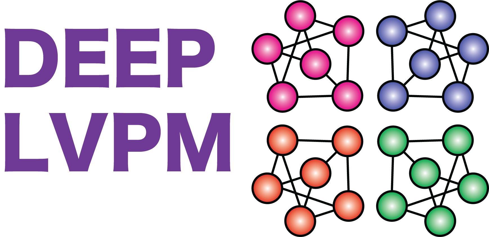
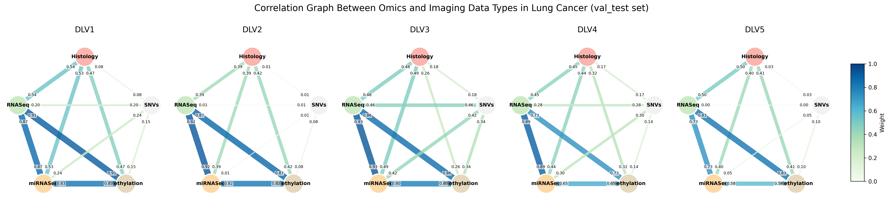

<p align="center">
  
</p>

# Deep Latent Variable Path Modelling (DLVPM)

Deep Latent Variable Path Modelling (DLVPM) is a method for path/structural equation modelling utilising deep neural networks. The aim of the method is to connect different data types together via sets of orthogonal deep latent variables (DLVs). Full documentation for this package can be found here: https://deep-lvpm.readthedocs.io/en/latest/. This work has now been published here: https://www.nature.com/articles/s42256-025-01052-4.

Full documentation for the keras3 version of this toolbox is provided here:
[https://deep-lvpm.readthedocs.io/en/latest/](https://deep-lvpm.readthedocs.io/en/latest/)

This branch of the repo has been refactored and is now written in Pytorch only. The tutorials found here are also written in Pytorch and follow the same form as the keras3 version.

If you find this project useful, consider starring the repository on GitHub.


---

# Installation

```bash
uv venv  # create environment
uv pip install .
```

---

# Tutorials

Three runnable tutorials are included: 


## Integrate five TCGA lung cancer modalities
```bash
uv run -m tutorial.run_tcga
```




## Associate MNIST images with digit labels
```bash
uv run -m tutorial.run_mnist
```

## Demonstrate a Siamese encoder on CIFAR-10.
```bash
uv run -m tutorial.run_siamese
```

---

# Testing

Run the test suite with:

```bash
uv run -m tests.run_tests
```
