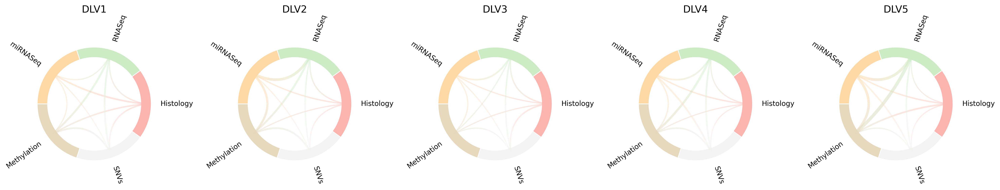

<p align="center">
  
</p>

# Deep Latent Variable Path Modelling (DLVPM)

Deep Latent Variable Path Modelling (DLVPM) is a framework for **path / structural equation modelling using deep neural networks**. The method links heterogeneous datasets through sets of **orthogonal deep latent variables (DLVs)**, enabling structured multimodal learning.

Full documentation:
[https://deep-lvpm.readthedocs.io/en/latest/](https://deep-lvpm.readthedocs.io/en/latest/)

Published in Deep Latent Variable Path Modelling in Nature Machine Intelligence.

If you find this project useful, consider starring the repository on GitHub.



The animation above shows model training for a **three-factor DLVPM model** linking omics and imaging data from lung cancer patients.
This dataset is included with the package.

---

# Installation

```bash
uv pip install .
```

[Optional] Dev tools
```bash
uv pip install .[dev]
```

---

# Tutorials

Three runnable tutorials are included: 

Associate MNIST images with digit labels.
```bash
uv run -m tutorial.run_mnist
```

Integrate five TCGA lung cancer modalities.
```bash
uv run -m tutorial.run_tcga
```

Demonstrate a Siamese encoder on CIFAR-10.
```bash
uv run -m tutorial.run_siamese
```

All tutorials report the following metrics from `StructuralModel.evaluate`:

* `total_loss`
* `cross_metric`
* `mse_loss`
* `redundancy`

---

# Testing

Run the test suite with:

```bash
uv run -m tests.run_tests
```


# TODO 
- [ ] Update docs